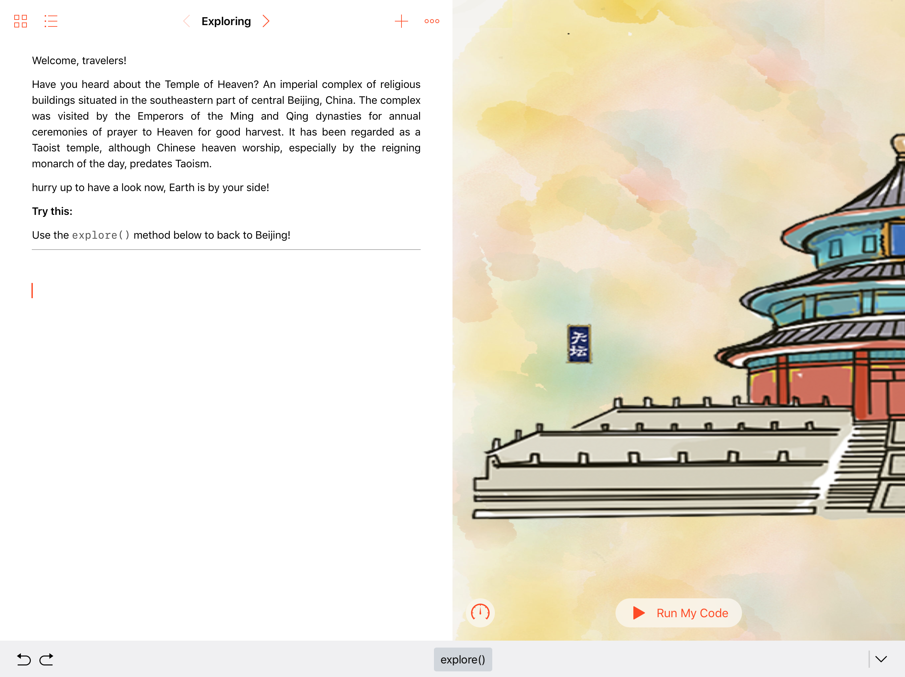
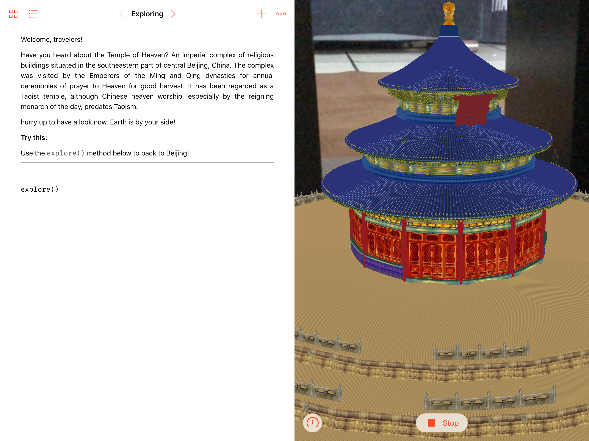

# WWDC18Apply
   

[a Swift Playgrounds Project applying for WWDC18](https://github.com/zjzsliyang/WWDC17Apply)

## Description

### Open Source Software

[Colorful Image Colorization](https://github.com/richzhang/colorization)

### Features and Technologies

### Beyond WWDC18

### Comments

## Screenshot

